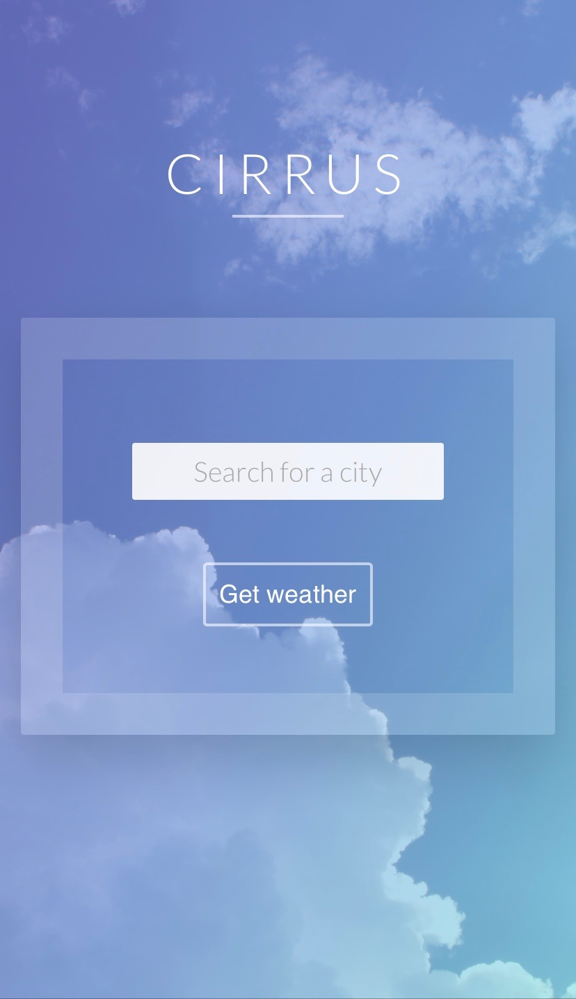
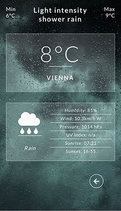
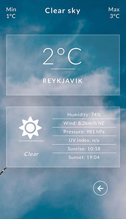
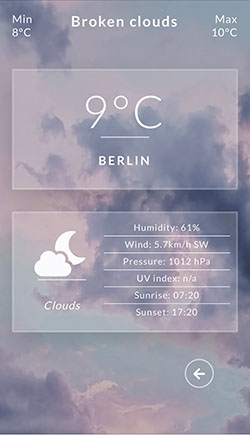
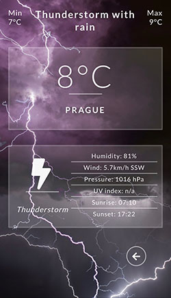

# Cirrus weather app

## Stack

- Framework: Vue.js with Vuex and VueCLI
- Style: CSS3 with Sass
- API: OpenWeather (using axios)

## Features

Current weather data for several cities presented through beautiful weather cards.

**Example cities provided with weather data:**
- Amsterdam, Berlin, Budapest, Copenhagen, Debrecen, Gyor, Helsinki, London, Miskolc, Munich, Oslo, Prague, Reykjavik, Szeged, Vienna, Zagreb, Zurich

Weather data is fetched from thir-party API provider 'openweathermap.org'.

**Weather data includes:**
- current temperature
- daily minimum temperature
- daily maximum temperature
- weather condition and detailed description
- humidity
- wind speed and direction
- pressure
- UV index (coming soon)
- sunrise and sunset

Live weather data for each city is fetched through API calls.

The data is visualized through 'weather cards' dynamically representing the weather conditions, such as:
- background image
- weather icon

**Weather alerts**

Warnings are displayed in case of hazardous weather conditions.

The following conditions are watched:
- current temperature
- daily minimum temperature
- daily maximum temperature
- wind speed
- UV index
- weather condition

 **Example screenshots**

