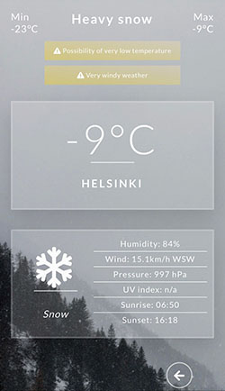

# Cirrus weather app

## Stack

- Framework: Vue.js with Vuex and VueCLI
- Style: CSS3 with Sass
- Database: Firestore
- API: OpenWeather (using axios)

## Features

Current weather data for several cities presented through beautiful weather cards.

**Example cities provided with weather data:**
- Amsterdam, Berlin, Budapest, Copenhagen, Debrecen, Gyor, Helsinki, London, Miskolc, Munich, Oslo, Prague, Reykjavik, Szeged, Vienna, Zagreb, Zurich

Weather data is fetched from thir-party API provider 'openweathermap.org'.

**Weather data includes:**
- current temperature
- daily minimum temperature
- daily maximum temperature
- weather condition and detailed description
- humidity
- wind speed and direction
- pressure
- UV index (coming soon)
- sunrise and sunset

Weather data for each city is stored in a database and will only be updated with fresh data after 30 minutes. Querrying data for a city within that time interval will read the data from the database and will not make an API call.

The data is visualized through 'weather cards' dynamically representing the weather conditions, such as:
- background image
- weather icon

**Weather alerts**

Warnings are displayed in case of hazardous weather conditions.

The following conditions are watched:
- current temperature
- daily minimum temperature
- daily maximum temperature
- wind speed
- UV index
- weather condition

**Weather forecast**

Forecasted weather data are displayed for mornings (UTC 9:00) and afternoons (UTC 15:00) for each of the next 4 days.

Displayed weather data includes condition icon and estimated temperature for the given time.

 **Example screenshots**

